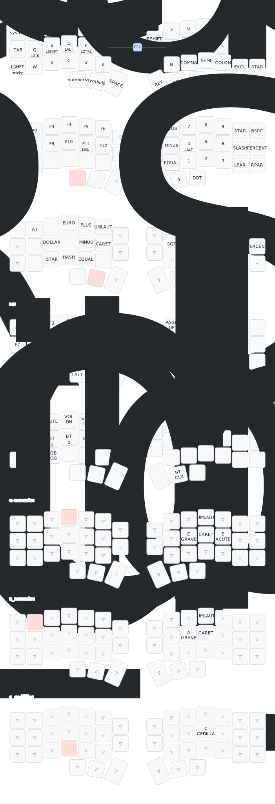

# Corne Choc Pro config (Français)

## My Keyboard
- Keyboard: Corne Choc Pro Bluetooth from [Keebart](https://keebart.com/)
- 42 keys
- no screen
- no rotary encoder
- board: nRF52840 M.2 Module (nrf52840_m2)

## My layout 

Change the layout with the [online keymap editor](https://nickcoutsos.github.io/keymap-editor/)

Keymap draw with https://keymap-drawer.streamlit.app/
